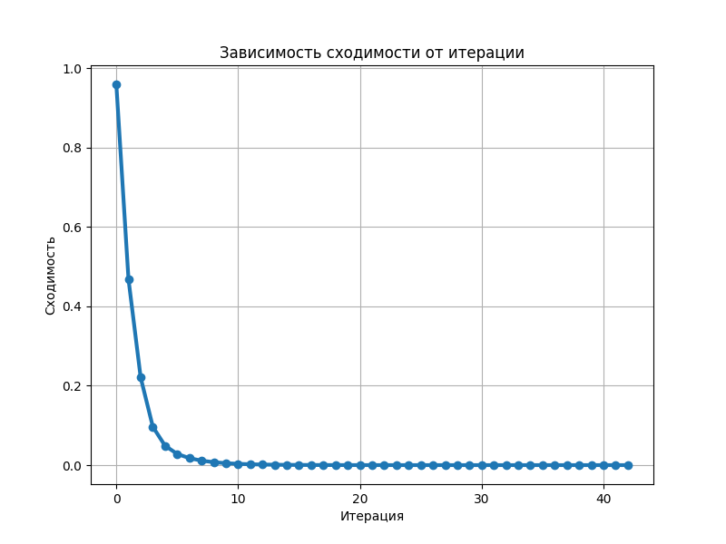
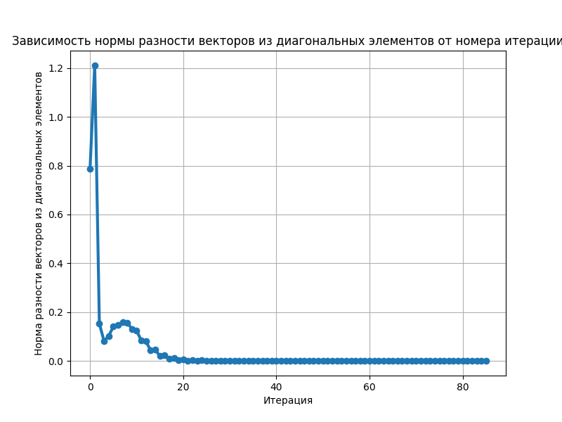
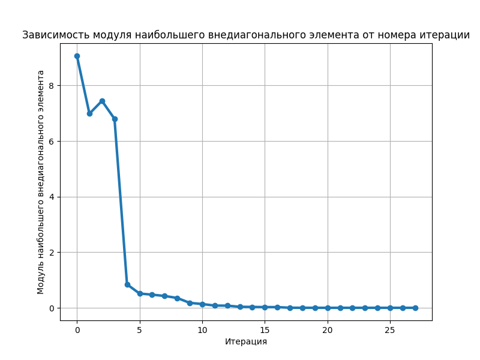

# Матричные методы для нахождения собственных чисел

Этот проект предоставляет реализации нескольких методов для нахождения собственных чисел матрицы. Он разработан для работы с вещественными матрицами, для которых подразумевается наличие вещественных собственных чисел.

## Установка

```bash
git clone https://github.com/s0lovevis/PyEigenSolver.git
cd PyEigenSolver
pip install -r requirements.txt
```

## Методы

### 1. Метод степенной итерации

Находит наибольший по модулю собственный вектор и соответствующее ему собственное значение. При необходимости может построить график для визуализации сходимости итерационного процесса.

### 2. Метод вращений Якоби

Подходит для симметричных матриц и находит все собственные числа и вектора. Использует итеративное применение преобразования поворота для обнуления наддиагональных элементов.

### 3. QR метод

Работает с любыми матрицами и основан на итеративном перемножении элементов QR-разложения согласно определенной формуле. Возвращает массив всех собственных значений матрицы.

### 4. Прямой метод раскрытия определителя

Находит все собственные числа матрицы с помощью решения характеристического уравнения. Составление характеристического полинома реализовано самостоятельно, нахождение его корней - с помощью метода из numpy.

## Примеры использования

### 1. Метод степенной итерации

```python
import numpy as np
import matplotlib.pyplot as plt
from eigen_solver import power_iteration_method

matrix = np.array(...)

# Нахождение наибольшего по модулю собственного значения и вектора с опцией графика
eigenvalue, eigenvector = power_iteration_method(matrix, plot=True)
```


### 2. QR метод

```python
import numpy as np
import matplotlib.pyplot as plt
from eigen_solver import qr_method

matrix = np.array(...)

# Нахождение всех собственных чисел матрицы
eigenvalues =  qr_method(matrix, plot=True)
```



### 3. Метод вращений Якоби

```python
import numpy as np
import matplotlib.pyplot as plt
from eigen_solver import jacobi_rotations_method

# ВАЖНО! В данном методе матрица должна быть симметричной - в ином случае получаем исключение
matrix = np.array(...)

# Нахождение всех собственных чисел и векторов матрицы. Вектора есть столбцы в eigenvectors
eigenvalues, eigenvectors =  jacobi_rotations_method(matrix)
```



### 4. Метод решения характеристического уравнения

```python
import numpy as np
from eigen_solver import direct_method

matrix = np.array(...)

# Нахождение всех собственных чисел матрицы
eigenvalues = direct_method(matrix)
```
